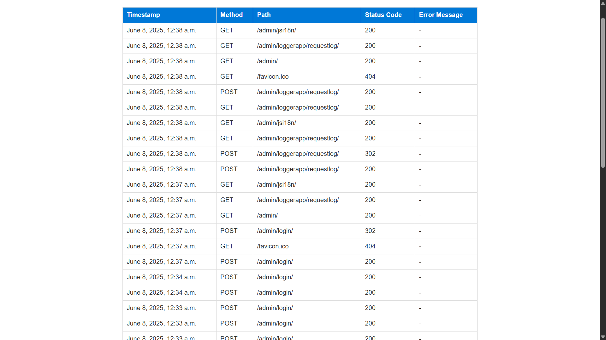
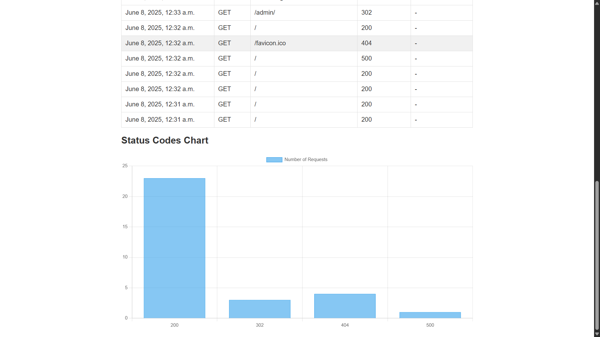
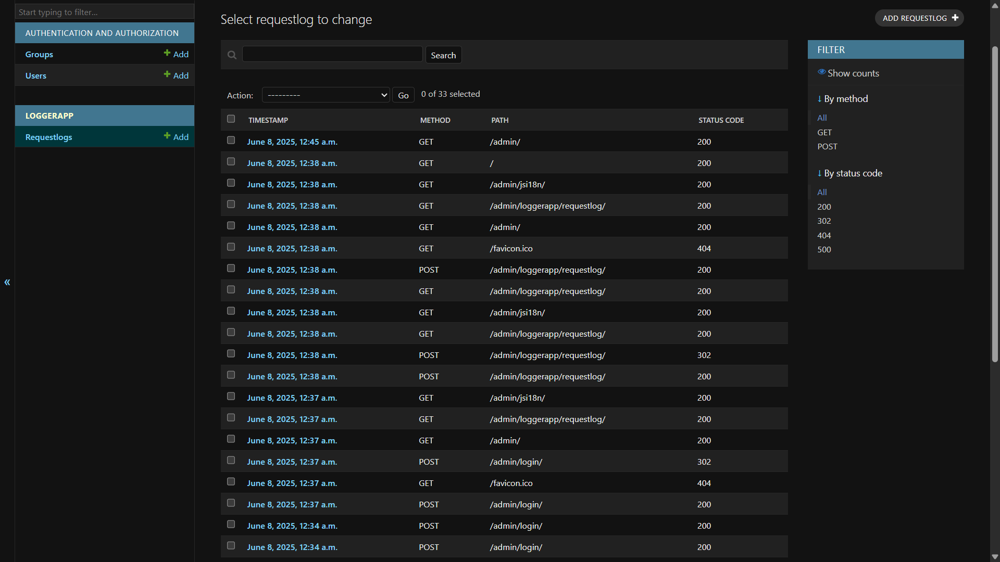

# Custom_MiddleWare

# Logger App

## Task Description
This Django project logs HTTP requests and responses including timestamp, method, URL path, status code, and error messages. It displays the logs in a table and shows a chart of status code counts. The logs can also be managed through the Django admin panel.

## Screenshots

### Request Logs Table  

### Status Code Chart  

### Django Admin Page  

## Widget / Algorithm Used
- Middleware captures each request and response, logs data to the database.
- Django admin to view and manage logs.
- HTML table for listing logs.
- Chart.js bar chart to visualize counts of different status codes.
